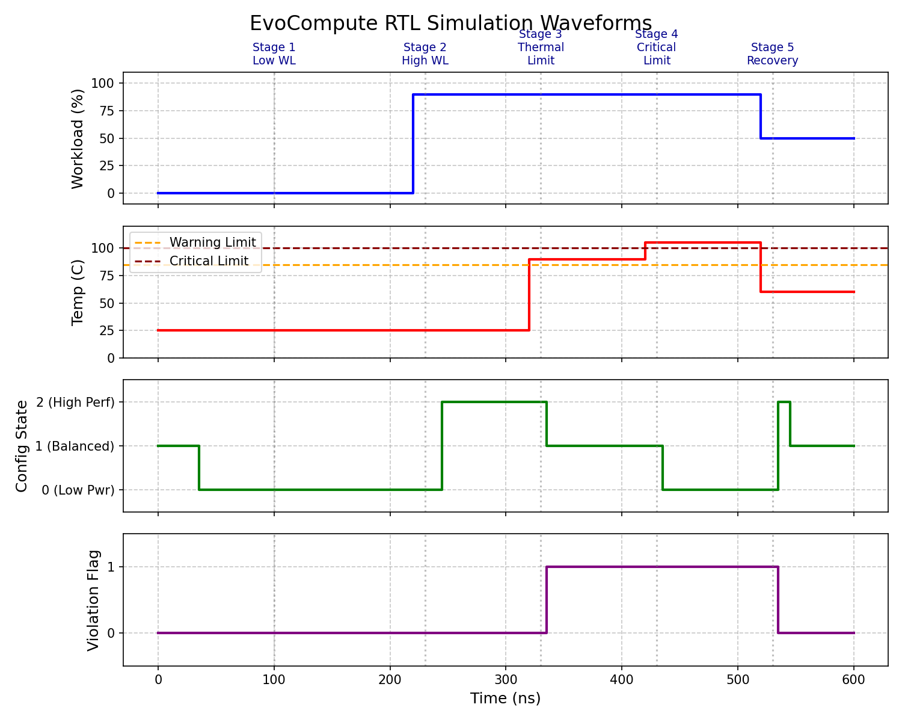

# EvoCompute: One Silicon. Many Optimal Machines.

**EvoCompute** is a mission-driven, predictive architecture that dynamically selects from a hardware-certified configuration space to jointly optimize workload performance, energy, reliability, and system health.

By turning the architecture itself into a runtime variable, EvoCompute effectively allows a single piece of silicon to serve as multiple optimal machines depending on its environment and mission requirements—all while remaining safely bounded by immutable hardware invariants.

## The Core Concept

Modern chips are designed years before deployment based on a fixed set of assumptions. But in reality:
- Workloads spike and stall.
- Thermal boundaries shift.
- Silicon wears and degrades.

EvoCompute addresses this by closing the loop directly in hardware:
1. **Sense:** Monitors physical health (temperature) and workload intensity.
2. **Predict & Policy:** A Policy Engine decides the optimal *Certified Configuration* (e.g., Low Power, Balanced, High Performance).
3. **Constitution (Safety):** A strict *Hardware Constitution* intercepts the policy decision and overrides it if physical limits (e.g., thermal thresholds) are violated.
4. **Morph:** The underlying compute fabric adapts its clock, cache, and redundancy state to match the approved configuration.

## RTL Implementation Overview

This repository contains the initial proof-of-concept RTL implementation of the EvoCompute wrapper, integrated with the [PicoRV32](https://github.com/YosysHQ/picorv32) open-source RISC-V core.

### Directory Structure
```
evocompute/
├── docs/                      # Documentation and images
│   └── img/waveform.png       # Simulation waveform plot
├── rtl/                       # Verilog / SystemVerilog Sources
│   ├── accelerator.sv         # Dynamic compute accelerator
│   ├── dsp.sv                 # Dynamic DSP block
│   ├── evocompute_top.sv      # Top-level integration wrapping the CPU and Evo logic
│   ├── fault_recovery_engine.sv # Formal fault monitoring
│   ├── hardware_constitution.sv # Enforces physical thermal limits and security rules
│   ├── learning_engine.sv     # Dynamic thresholding based on mission weights
│   ├── mission_optimizer.sv   # Maps mission profiles to utility weights
│   ├── picorv32.v             # The underlying RISC-V core
│   ├── policy_engine.sv       # Pipeline wrapper for prediction and state selection
│   ├── predictor.sv           # EWMA state prediction
│   ├── redundancy_manager.sv  # Manages lockstep voting / redundancy 
│   ├── security_monitor.sv    # Detects incoming threat conditions
│   ├── sensor_mock.sv         # Mocks environmental telemetry
│   └── switching_economics.sv # Hysteresis logic to prevent thrashing
├── tb/                        # Testbenches
│   └── evocompute_tb.sv       # Main testbench injecting dynamic workloads/thermal events
└── README.md                  # This file
```

### Module Descriptions

- **Sensor Mock (`sensor_mock.sv`):** Provides environmental data simulating thermal sensors, workload monitors, fault sensors, and security threats.
- **Policy Engine (`policy_engine.sv`):** Acts as a high-level wrapper that instantiates advanced analytical blocks to determine the optimal configuration:
  - **Predictor (`predictor.sv`):** Uses an Exponential Weighted Moving Average (EWMA) to predict upcoming workload and temperature spikes.
  - **Mission Optimizer (`mission_optimizer.sv`):** Translates high-level mission profiles into utility function weights.
  - **Learning Engine (`learning_engine.sv`):** Evaluates predicted metrics against dynamically adjusted mission weights to suggest an optimal state.
  - **Switching Economics (`switching_economics.sv`):** Applies hysteresis to prevent thrashing between configuration states, enforcing a stability penalty.
- **Hardware Constitution (`hardware_constitution.sv`):** An independent, formally certified safety block. It enforces strict invariants, overriding the Policy Engine during thermal emergencies, hardware faults (from **`fault_recovery_engine.sv`**), or security lockdowns (from **`security_monitor.sv`**).
- **Dynamic Compute Blocks:**
  - **Accelerator (`accelerator.sv`) & DSP (`dsp.sv`):** Compute units that dynamically power up or gate their clocks depending on the active configuration.
  - **Redundancy Manager (`redundancy_manager.sv`):** Asserts voting logic between duplicated cores during "Reliable" states, shutting down redundancy during pure "Performance" states.
- **EvoCompute Top (`evocompute_top.sv`):** Connects the sensors, policy engine, constitution, and dynamic IP blocks, adapting the system topology in real-time.

## Quantitative Impact & Economic Viability

The real strength of EvoCompute goes beyond adaptive switching—it creates **mathematical and economic viability** across three critical layers: Operational Utility, NRE Savings, and Fleet Resilience.

### 1. The Mission Utility Function
EvoCompute continuously solves for the maximum **Mission Utility ($U$)**:

$$
U = w_pP + w_eE + w_rR + w_sS - w_tT - w_cC
$$

Where:
- $P$ = Performance | $E$ = Energy Efficiency | $R$ = Reliability 
- $S$ = Security/Safety | $T$ = Thermal/Latency Penalty | $C$ = Lifecycle-carbon cost
*(Weights $w$ vary per mission profile. The hardware constitution restricts the solution space to guarantee survival, allowing the Policy Engine to freely maximize $U$.)*

### 2. Platform Economics (Net NRE Savings)
By deploying *one adaptive platform* serving multiple mission profiles instead of spinning multiple fixed variants, the Non-Recurring Engineering (NRE) savings scale directly. 

For a baseline three-product portfolio (one base chip + two variants), the net saving can be modeled as:

$$
\text{Net NRE saving} = (2d - e - 2m) \times F
$$

- $F$: Base ASIC design cost (e.g., ~$48M at 28nm)
- $d$: Cost of a derivative design (e.g., 35% of $F$)
- $e$: EvoCompute logic overhead (e.g., 15-30% of $F$)
- $m$: Cost to certify a new mission profile (e.g., 4% of $F$)

Even at a conservative 30% overhead ($e=0.3$) and 35% derivative cost ($d=0.35$), **a single three-product portfolio avoids ~$15.4M in redesign costs**.

### 3. Customer ROI (Resilience vs. Energy)
While dynamic energy saving is useful (e.g., 15% off a 20W node yields ~$2.60/year), the true ROI of EvoCompute stems from **avoided stoppages** due to hardware fatigue or thermal throttling.

$$
\text{Annual Resilience Value} = \lambda \times \mu \times T \times C
$$

- $\lambda$: Compute-attributable stoppages per year
- $\mu$: Fraction mitigated by EvoCompute's graceful degradation
- $T$: Hours per stoppage | $C$: Cost per hour of downtime

At a baseline industrial downtime cost of $36,000/hour, preventing just *one compute-induced plant stoppage per 7,000 node-years* completely pays for the EvoCompute silicon overhead. In high-stakes automotive or FMCG sectors, this payback scales exponentially.

## Simulation and Results

The testbench (`evocompute_tb.sv`) stresses the logic across five distinct stages to prove the adaptive behavior.

### Running the Simulation
To run the simulation locally, you will need [Icarus Verilog](https://steveicarus.github.io/iverilog/) installed.
```bash
iverilog -g2012 -o evocompute.vvp rtl/sensor_mock.sv rtl/policy_engine.sv rtl/hardware_constitution.sv rtl/picorv32.v rtl/evocompute_top.sv tb/evocompute_tb.sv
vvp evocompute.vvp
```

### Waveform Analysis



As demonstrated in the waveform above:
1. **Stage 1 (Low Workload):** The policy engine safely runs the chip in Low Power mode (Config 0).
2. **Stage 2 (High Workload Spike):** The policy engine jumps to High Performance mode (Config 2).
3. **Stage 3 (Thermal Warning):** The temperature crosses the 85°C warning threshold. The Hardware Constitution intercepts the Policy Engine and downgrades the chip to Balanced mode (Config 1) to stem thermal runaway.
4. **Stage 4 (Critical Thermal Limit):** The temperature crosses the 100°C critical threshold. The Constitution completely forces the chip into Low Power mode (Config 0) regardless of the workload demand, ensuring survival.
5. **Stage 5 (Recovery):** Temperatures normalize, and the chip is allowed to resume its workload-directed state (Balanced, Config 1).
